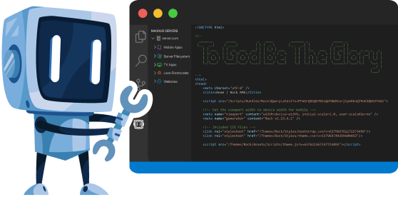

  

# Magnus Visual Studio Code Editor for Rock RMS 

Triumph Tech’s Magnus Editor is a full-featured remote editor for Rock RMS. [Rock RMS](https://www.rockrms.com) is an open source Relationship Management System (RMS) and Application Framework for 501c3 organizations.

Magnus allows you to directly edit content hosted in Rock. This is especially useful in the creation of custom websites and mobile apps.

    

# Getting Started

To get started you’ll need to:

1. Install the Visual Studio Code Extension
2. Install the Free Magnus Rock Plugin from the Rock Shop. 

Once these two steps are complete you’ll then head over to the plugin settings page (https://your_server/magnus) to provide configuration to maximize the security of your editing experience. Options exist to:

1. Limit the individuals who are allowed to use Magnus.
2. Lockdown IP address and networks that are allowed to connect to the server.
3. Determine which features (e.g. virtual filesystems) that are enabled.

# Additional Details

For more details and documentation on this plugin please see our [Triumph Tech Magnus page](https://www.triumph.tech/magnus).
