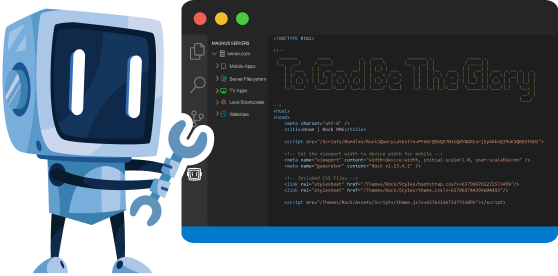
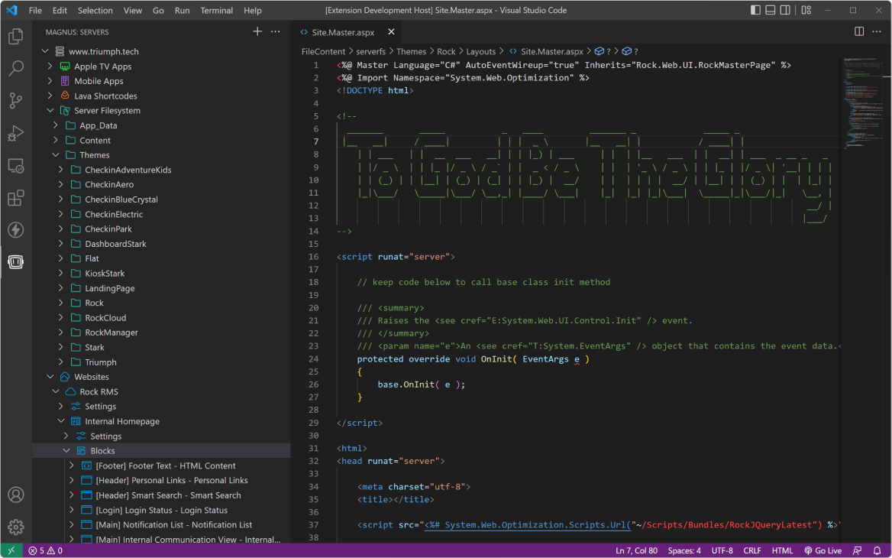

  

# Magnus Visual Studio Code Editor for Rock RMS 

Triumph Tech’s Magnus Editor is a full-featured remote editor for Rock RMS. [Rock RMS](https://www.rockrms.com) is an open source Relationship Management System (RMS) and Application Framework for 501c3 organizations.

Magnus allows you to directly edit content hosted in Rock. This is especially useful in the creation of custom websites and mobile apps.

    

# Editing Modes

Magnus supports two ways of editing Rock content:

**Cloud mode** is the original workflow, stable since 1.0. Right-click a Rock content node in the Magnus tree to edit it inline; changes save straight to the server through a virtual filesystem.

**Local mode** is a new beta workflow added in 1.1.0. Pull a mobile app to a real folder on disk so AI coding tools (Claude Code, Cursor, Copilot, etc.) can read and edit it as ordinary files. Changes are tracked in a Source Control panel with explicit Push and Fetch actions; there is no automatic background sync. Currently scoped to mobile apps only.

To pull an app to local, right-click a mobile app in the tree and choose **Pull to Local Workspace…**. See the [Change Log](CHANGELOG.md) for the full feature list, settings, and current limitations.

# Getting Started

To get started you’ll need to:

1. Install the Visual Studio Code Extension
2. Install the Free Magnus Rock Plugin from the Rock Shop. 

Once these two steps are complete you’ll then head over to the plugin settings page (https://your_server/magnus) to provide configuration to maximize the security of your editing experience. Options exist to:

1. Limit the individuals who are allowed to use Magnus.
2. Lockdown IP address and networks that are allowed to connect to the server.
3. Determine which features (e.g. virtual filesystems) that are enabled.

# SQL Tools

Magnus includes the SQL tooling that previously lived in our retired Azure
Data Studio extension, rebuilt for VS Code and expanded. All queries run
server-side through the Magnus plugin (v2.0 or later) using your existing
Magnus login — no direct database connection is ever made.

- **Browse** — every server in the Magnus panel gets a SQL node with its
  databases, tables, and columns. **Go to Table** fuzzy-searches every table.
- **Query** — right-click a server for a New Query, or press
  `Ctrl+K Ctrl+G` (`Cmd+K Cmd+G` on Mac) anywhere for a scratch query
  against your last-used server. Run the whole file (`Ctrl+Shift+E`), the
  statement under the cursor (`Ctrl+Enter`), or any statement's Run code
  lens. Files inside a pulled Magnus workspace bind to that workspace's
  server automatically. Switch servers with `Ctrl+K Ctrl+B`.
- **Results** — result sets open in a grid beside the editor: sort-free
  fast scrolling at 100k+ rows, rectangular selection, a cell inspector
  that pretty-prints JSON and XML, and a transposed row inspector. Copy
  selections as tab-delimited, Markdown, CSV, JSON, or INSERT statements;
  export to CSV, JSON, or Excel. A value that a spreadsheet would read as a
  formula is neutralized on the way out, so a string stored in Rock cannot
  become live Excel content (`magnus.sql.sanitizeSpreadsheetCells`).
- **IntelliSense** — table completion after FROM/JOIN using the tables on
  your actual server, column completion after an alias (or unprefixed when
  one table is in scope), hover documentation with live column lists, and
  ready-made JOIN clauses: type `JOIN` and accept a complete
  `PersonAlias pa ON pa.Id = a.PersonAliasId`, including a one-keystroke
  two-hop join through PersonAlias to Person.
- **History** — every run is recorded per server. `Ctrl+K Ctrl+H` opens a
  searchable history with re-run, open, and copy. Tip: start a query with a
  `-- comment` and that comment becomes its history label.
- **Snippets** — type `rock-` for common Rock queries (person search,
  attendance ranges, giving totals, and more), all using correct
  PersonAlias joins. Add your own alongside them via
  **Preferences: Configure Snippets → sql**.
- **Safety** — servers are treated as production by default: destructive
  statements prompt before running and the status bar shows a red badge.
  Tag a server as staging or development (**Magnus SQL: Set Server
  Environment**) to relax the guard.

# Additional Details

For more details and documentation on this plugin please see our [Triumph Tech Magnus page](https://www.triumph.tech/magnus).
